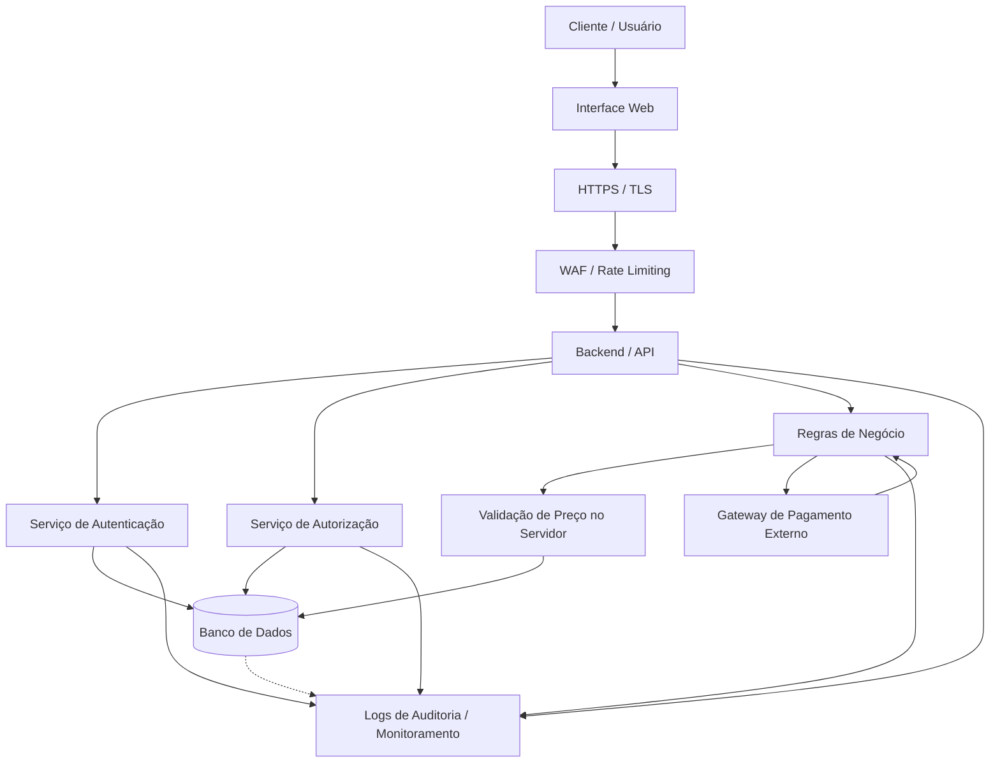

# Arquitetura Segura — TechStore

## Legenda

* **Cliente / Usuário:** usuário que acessa a plataforma.
* **Interface Web:** camada de interação com o sistema.
* **HTTPS / TLS:** proteção da comunicação.
* **WAF / Rate Limiting:** proteção contra requisições abusivas e ataques automatizados.
* **Backend / API:** processamento das requisições.
* **Serviço de Autenticação:** validação da identidade do usuário.
* **Serviço de Autorização:** validação das permissões do usuário.
* **Regras de Negócio:** processamento das operações da plataforma.
* **Validação de Preço no Servidor:** garantia da integridade dos valores utilizados no checkout.
* **Banco de Dados:** armazenamento dos dados da aplicação.
* **Gateway de Pagamento Externo:** processamento das transações financeiras.
* **Logs de Auditoria / Monitoramento:** registro e acompanhamento de eventos relevantes de segurança.
